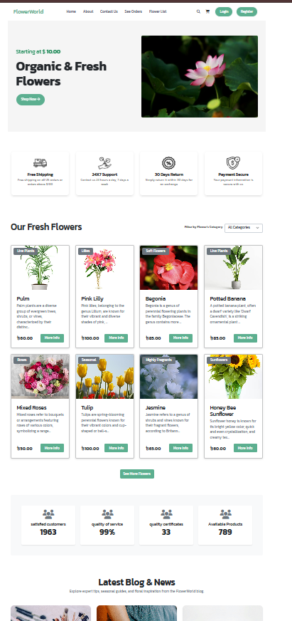
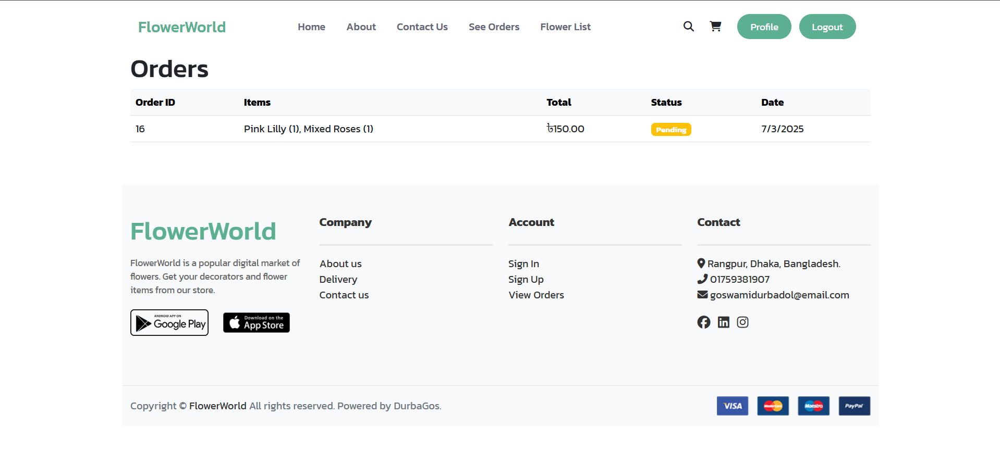
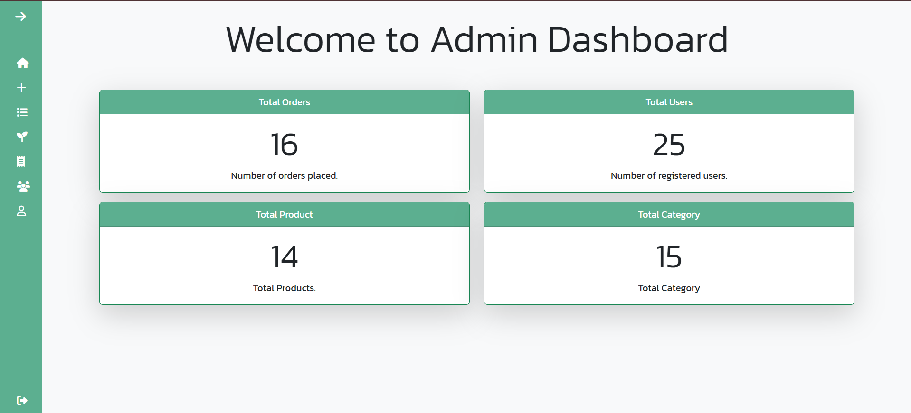

# 🌸 FlowerWorld

**FlowerWorld** is a full-featured eCommerce web application where users can browse and purchase flowers, and administrators can manage orders and product listings. It supports user authentication, order management, category filtering, dynamic user dashboards, and email notifications.

---

## 📑 Table of Contents

- [Overview](#-overview)
- [Live Demo](#-live-demo)
- [Core Features](#-core-features)
- [Screens & Pages](#️-screens--pages)
- [Technologies Used](#-technologies-used)
- [Folder Structure](#-folder-structure)
- [API Endpoints](#-api-endpoints)
- [How to Run Locally](#️-how-to-run-locally)
- [Authentication Info](#-authentication-info)
- [Screenshots](#-screenshots)
- [Contact](#-contact)
- [License](#-license)

---

## 🔍 Overview

FlowerWorld is designed to provide a smooth floral shopping experience with modern UI, responsive design, and real-time interactions. Users can explore flowers by category, view details, place orders, and track order status. Admins can manage flowers, users, and monitor business performance via the dashboard.

---

## 🚀 Live Demo

Frontend: [https://flower-world.vercel.app](https://flower-world.vercel.app)  
Backend API: [https://flowerworld-api.vercel.app](https://flowerworld-api.vercel.app)

---

## 🚀 Core Features

### 👤 User Side:
- ✅ User Registration and Login (Token-based)
- 🔐 Email verification after registration
- 🌸 Browse flowers with images, description, and price
- 🛒 One-click “Buy Now” ordering system
- 📦 View order history and current order status
- 📂 Filter flowers by category
- 📬 Receive confirmation email after placing an order
- ✍️ Newsletter subscription
- 📝 Read latest blog posts

### 🛠️ Admin Side:
- 🧑‍💼 Admin login with role-based access
- 📋 View all orders and change status (Pending ➝ Completed)
- 📨 Send email to user on order status change
- 🏷️ Add, update, delete flower listings
- 📊 Dashboard with order and product stats
- 📈 View customer testimonials and feedback

---

## 🖼️ Screens & Pages

### Frontend Pages:
- `index.html` – Home
- `register.html` / `login.html` – Authentication
- `all_flowers.html` – Flower listings with category filter
- `flower_details.html` – Product detail view
- `cart.html` / `checkout.html` – Cart and Checkout process
- `order_confirmation.html` / `payment_success.html` / `payment_failed.html` – Payment responses
- `profile.html` / `update-profile.html` / `change-password.html` – User profile pages
- `admin/*.html` – Admin views and controls
- `testimonial.html` – Testimonials
- `about.html`, `contact.html` – Informational pages
- `Newsletter` section on the homepage

---

## 🧪 Technologies Used

### 💻 Frontend:
- HTML5, CSS3
- JavaScript (Vanilla)
- Bootstrap 5
- Tailwind CSS (partially)
- Owl Carousel for testimonials

### 🖥️ Backend:
- Python 3
- Django 4.x
- Django REST Framework (DRF)
- SQLite (default, can be switched to PostgreSQL/MySQL)
- Django Email Utilities for notifications

---

### 📦 Other Tools
- **PostgreSQL** (or SQLite)
- **Vercel** for frontend deployment
- **Render** for backend hosting (Django API)
- **Imgbb** used for flower images

---

## 📁 Folder Structure

### Frontend (`FlowerWorld Modified FE/`)
📁 image/  
📁 css/  
📁 js/  
📁 admin/  
📄 index.html  
📄 register.html  
📄 login.html  
📄 profile.html  
📄 flower_details.html  

### Backend (`FlowerWorld/`)
📁 FlowerWorld/ # Django settings  
📁 flowers/ # Flower model, views, serializers  
📁 order/ # Order model & logic  
📁 user/ # Custom user model & auth  
📁 payment/ # Payment success/failure pages  
📄 manage.py  
📄 requirements.txt  
📄 db.sqlite3  

---

## ⚙️ API Endpoints

- `POST /user/register/` — Register new user  
- `POST /user/login/` — Login  
- `GET /flowers/` — Get all flowers  
- `GET /flowers/category/<id>/` — Filter flowers by category  
- `POST /orders/` — Place order  
- `GET /orders/` — Get all orders (filtered by user in frontend)  
- `PATCH /orders/<id>/status/` — Update order status (admin)  
- `GET /user/profile/<user_id>/` — Get user profile  

---

## ✅ How to Run Locally

### Backend Setup
```bash
git clone https://github.com/durbadol218/FlowerWorld-New
cd FlowerWorld
python -m venv venv
source venv/bin/activate  # On Windows: venv\Scripts\activate
pip install -r requirements.txt
python manage.py migrate
python manage.py runserver
```

### ▶️ Frontend Setup
Open `index.html` directly in a browser for local testing, or deploy the frontend folder to [Vercel](https://vercel.com).

> 💡 You can configure `.env` or settings.py for your own API keys and email credentials.

---

## 🔐 Authentication Info

- Register at `/user/register/`
- Login at `/user/login/` (returns JWT token)
- Access protected endpoints using:
```http
Authorization: Bearer <your_token>
```

---

## 🖼 Screenshots

| Home Page | Order Page | Admin Dashboard |
|-----------|------------|------------------|
|  |  |  |

---

## 💌 Contact

**Project Owner:** Durbadol Goswami  
📧 Email: goswamidurbadol@gmail.com  
🌐 Portfolio: https://responsive-portfolio-blond.vercel.app/  
🔗 GitHub: https://github.com/durbadol218

---

## 📃 License

This project is licensed under the MIT License. Feel free to use and customize as needed.
